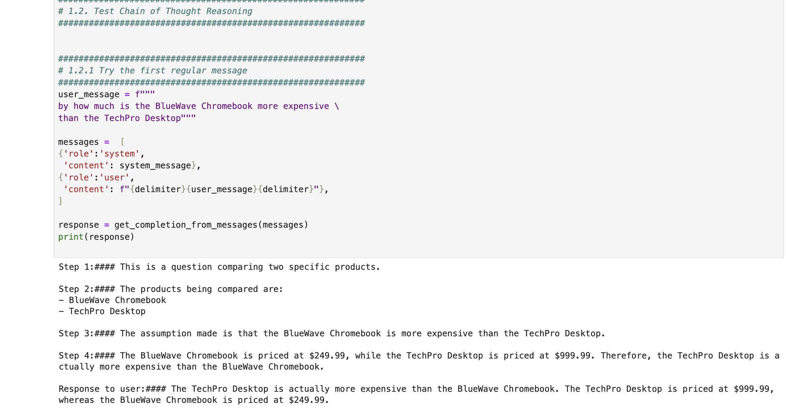
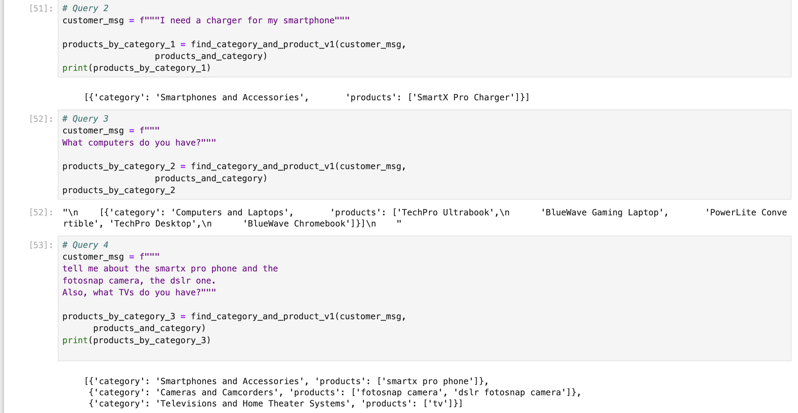
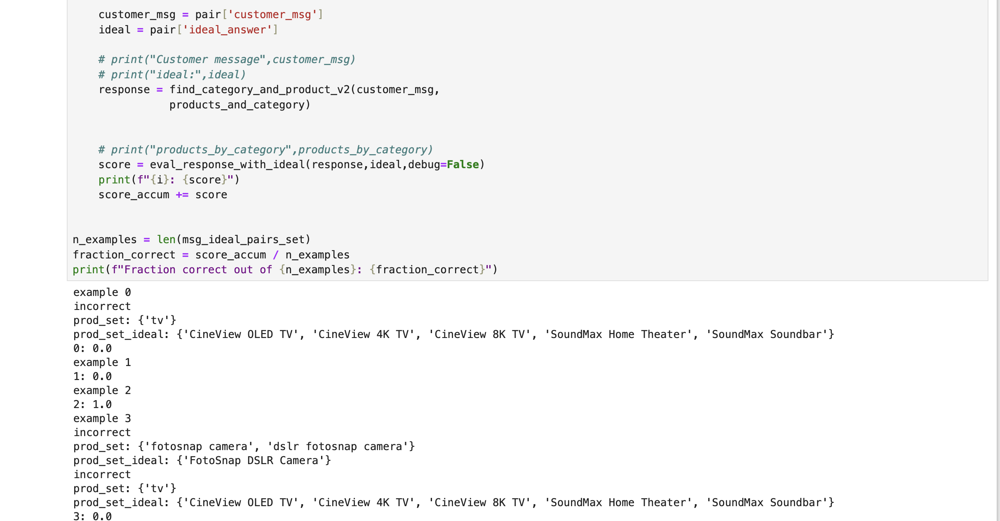
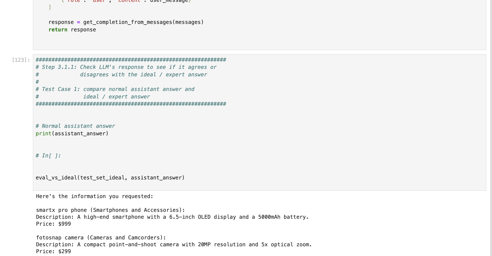

# Customer Support System: Moderation, Classification, and Evaluation Using ChatGPT API

## Overview

This project implements an AI-driven customer support system using the ChatGPT API. The system focuses on automating key customer service tasks such as:

- **Prompt Moderation:** Detect and filter inappropriate content from customer queries.
- **Request Classification:** Automatically categorize customer requests (e.g., product queries, feedback).
- **Query Response:** Provide accurate and context-aware answers to customer questions using Chain of Thought reasoning.
- **Evaluation:** Compare system responses with ideal responses to measure accuracy and effectiveness.

## Key Features:

- \*\*Moderating inappropriate prompts
- \*\*Automatically classifying customer messages
- \*\*Answering queries with the Chain of Thought reasoning
- \*\*Evaluating chatbot responses

# Solution Overview:

- \*\*Propose an automated solution that:
- \*\*Moderates customer input to filter out inappropriate content
- \*\*Classifies customer requests into different categories (e.g., products, feedback)
- \*\*Uses Chain of Thought reasoning to generate accurate and relevant responses

## Project Setup

### Requirements

- OpenAI API Key
- Required Libraries:
  - `openai`
  - `dotenv`
  - `os`
  - `json`

Install dependencies:

```bash
pip install openai
export OPENAI_API_KEY="your-api-key-here"
```

## Testing

- The system was tested using multiple real-world scenarios, including:
  - Prompt injections
  - Product recommendations
  - Sentiment analysis

# Screenshot of execution results









# To learn more

[Google Slide](./assets/Customer_Support_System_Moderation_Classification_Evaluation.pptx)
